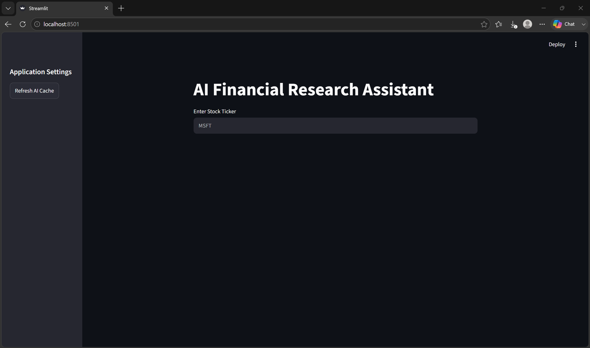

# AI Financial Research Assistant

A local-first financial research application that combines Yahoo Finance data,
deterministic Python analytics, constrained local-LLM interpretation, interactive
charts, and downloadable reports.

The project is deliberately compact. Its purpose is to demonstrate clear external
data boundaries, typed financial models, testable calculations, grounded AI usage,
and consistent report generation—not to provide investment recommendations.



## What it does

- Retrieves a company profile, financial metrics, and historical prices from Yahoo
  Finance.
- Normalizes missing and non-finite financial values into immutable typed models.
- Calculates latest close, period high, period low, and average volume in Python.
- Displays historical prices in an interactive Plotly chart.
- Sends one structured research context to a local Llama 3.2 3B model through
  Ollama.
- Exports the same facts and AI analysis as Markdown and PDF reports.

## Architecture

```text
Streamlit UI
    |
    +--> ResearchService
    |        |
    |        +--> StockService
    |                 |
    |                 +--> YahooFinanceProvider --> Yahoo Finance
    |
    +--> ResearchContext
             |-- CompanyProfile
             |-- FinancialMetrics
             `-- PriceStatistics
                    |
                    +--> AnalysisService --> OllamaGenerator --> Llama 3.2 3B
                    |
                    `--> ReportService --> Markdown / PDF
```

`ResearchService` coordinates one combined company/metrics lookup and one history
lookup. Raw history remains available for charting, while durable facts are carried
in an immutable `ResearchContext` shared by analysis and reporting.

See [docs/architecture.md](docs/architecture.md) for the boundary responsibilities.

## Deterministic analytics

Price statistics are calculated by normal Python code—not by the LLM:

- latest usable closing price;
- highest and lowest usable close in the selected period;
- average usable volume.

Missing, NaN, and infinite values are excluded. History without a usable closing
price is rejected, while unavailable volume is represented as `N/A`.

## AI grounding

The model receives only `ResearchContext`: company identity, the available
financial metrics, selected period, and deterministic price statistics. The prompt
requires the model to distinguish facts from interpretation, identify data
limitations, and avoid unsupported claims or buy/sell advice.

This constraint reduces unsupported output but does not guarantee correctness. AI
analysis should be treated as a concise interpretation of the supplied data, not as
independent research or investment advice.

## Local stack

- Python 3.12
- Streamlit
- yfinance and pandas
- Plotly
- Ollama with `llama3.2:3b`
- ReportLab
- pytest

## Installation

Clone the repository and create a virtual environment:

```bash
git clone https://github.com/winston-lim-dev/ai-financial-research-assistant.git
cd ai-financial-research-assistant
python -m venv .venv
```

Activate it on Windows:

```powershell
.venv\Scripts\Activate.ps1
```

Or on macOS/Linux:

```bash
source .venv/bin/activate
```

Install the Python dependencies:

```bash
python -m pip install -r requirements.txt
```

Install [Ollama](https://ollama.com/), then download the configured model:

```bash
ollama pull llama3.2:3b
```

Start Ollama if it is not already running:

```bash
ollama serve
```

Run the application from the repository root:

```bash
streamlit run app/streamlit_app.py
```

Yahoo Finance access is needed for live research. Ollama is needed only when the
user requests AI analysis.

## Reports

After generating an AI summary, the application offers:

- a Markdown research report;
- a PDF research report.

Both formats consume the same `ResearchContext` and contain the same company data,
financial metrics, selected period, price statistics, and AI analysis. Missing
upstream values are displayed as `N/A`.

## Testing

```bash
pytest
```

Verified result:

```text
39 passed
```

Tests use synthetic pandas data, fake Yahoo providers, and a mocked Ollama call.
The complete test suite requires neither network access nor a running Ollama
service.

## Engineering decisions

- Yahoo Finance is isolated behind `YahooFinanceProvider`.
- Frozen dataclasses prevent accidental mutation of normalized financial facts.
- One Yahoo `info` payload is mapped into both `CompanyProfile` and
  `FinancialMetrics` during a research flow.
- Price analytics remain deterministic and independent of the LLM.
- `ResearchContext` is the shared input to AI analysis and both report formats.
- Streamlit caching stays in the UI composition layer; core services do not import
  Streamlit.
- Ollama is isolated behind a small injectable generation boundary.
- The prompt is constrained to supplied facts and explicitly disallows investment
  recommendations.

## Limitations

- Data availability and quality depend on Yahoo Finance; fields may be delayed,
  incomplete, or unavailable.
- Missing upstream fields appear as `N/A`.
- AI interpretation is limited to the small set of supplied metrics and may still
  be incorrect.
- This is a local, single-user research application and does not provide investment
  advice.
- It does not ingest SEC filings, news, or earnings calls.
- It does not use RAG, track portfolios, compare multiple companies, or generate
  recommendation scores.
- It has no authentication, cloud deployment, or production availability target.

## License

MIT. See [LICENSE](LICENSE).
